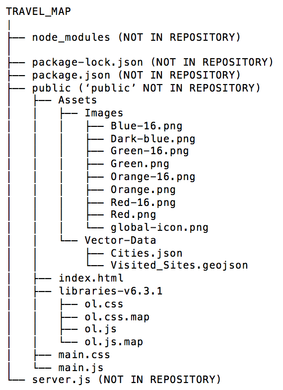

# OpenLayers Traveller GIS Map

### Introduction

OpenLayers (GIS software), is an open-source JavaScript library that serves the
purpose of displaying map data. The goal of this website is to pin point the world
cities that have been visited by the author of this project. Geographical coordinate 
data gets fetched from a .JSON document within the file system and it's viewable as 
long as the program runs in a local web server.

### Link
Link on Heroku: https://juan-s-travel-map-gis-project.herokuapp.com/

### Does the code require a local web server to run?
Yes.

### Directory Tree

### Technologies

1. HTML5
2. CSS3
   * Responsive Framework: Materialize
3. JavaScript
   * OpenLayers: version 6.3.1
   * ES6
4. Vector/Fetched Data: .JSON and .geoJSON
5. Node.js (Server-side)
6. NPM Module:
   * Web Application Framework: Express.js
